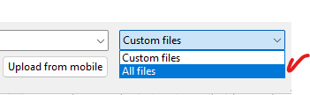

# Judge Instructions

These files are provided for **hackathon judges** to test the full MedNexus agent pipeline without needing to source their own medical data.

Two sample patient folders are included under `data/samples/` — each designed to trigger different agent combinations.

## Sample 01 — Chest / Respiratory Case

Folder: `data/samples/sample-01/`

| File | Type | What it triggers |
|---|---|---|
| `chest-xray.png` | Medical image | **Vision Specialist** — GPT-4o multimodal analysis with structured findings |
| `bloodwork.csv` | Lab results | **Clinical Sorter** — lab CSV classification and value extraction |
| `patient_transcript.txt` | Patient interview | **Patient Historian** — text extraction, RAG indexing, symptom analysis |
| `referral_letter.pdf.txt` | Referral document | **Patient Historian** — PDF text extraction and history synthesis |

**What to look for:** The patient says *"no chest pain"* — but the X-ray may show findings that contradict this. The Diagnostic Synthesis Agent will flag the discrepancy. The bloodwork shows elevated WBC, ESR, and CRP (inflammatory markers), which correlates with the imaging findings.

## Sample 02 — Sports Injury / Musculoskeletal Case / 2 Episodes

Folder: `data/samples/sample-02/`

| File | Type | What it triggers |
|---|---|---|
| `E2-muscle-inflammation.png` | Medical image | **Vision Specialist** — musculoskeletal imaging analysis |
| `E1-toe-left.png` | Medical image | **Vision Specialist** — secondary extremity image |
| `E2-audio-elbow.mp3` | Audio recording | **Patient Historian** — Whisper transcription + symptom extraction |
| `E1-patient_transcript_soccer.txt` | Patient interview | **Patient Historian** — text extraction and RAG indexing |

**Note:** Sample-02 can be used to experience the creation of 2 Episodes from the same Patient, which is why filenames have the `E1` and `E2` prefix. From the left menu select `+New` and a new empty case is waiting for uploads.

**What to look for:** Multiple images from different body regions, combined with an audio recording describing the injury. The Synthesis Agent merges visual findings with the patient's own words.

## How to use

1. Open MedNexus and select (or create) a patient by typing a new name or patient ID (for example `P037`) and pressing Enter.
2. Click **Upload File** and select files from either `data/samples/sample-01/` or `data/samples/sample-02/`.
3. **Important:** The file picker defaults to "Custom Files" — change the dropdown to **All Files** so `.txt` files are visible.
4. Watch the **Agent Stepper** on each episode card to follow the pipeline: Intake → Specialist → Cross-Check → Synthesis.
5. Watch the **Agent Chatter** pane to see each agent's reasoning in real time.
6. After all agents finish, the **Diagnostic Synthesis Report** appears automatically.
7. If a patient view does not immediately reflect the latest status, refresh the browser once. The backend state is preserved and the page will resync.

## Note

You do **not** need to follow any file naming convention when uploading through the UI. The system automatically prefixes the patient ID. Just drag and drop.
