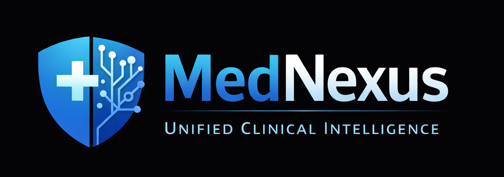
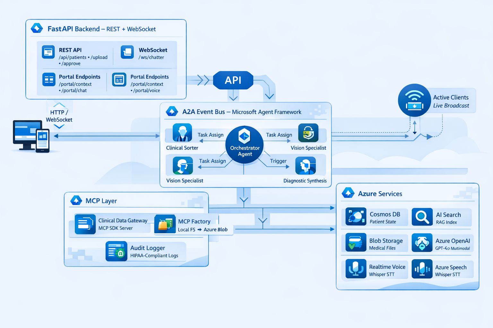
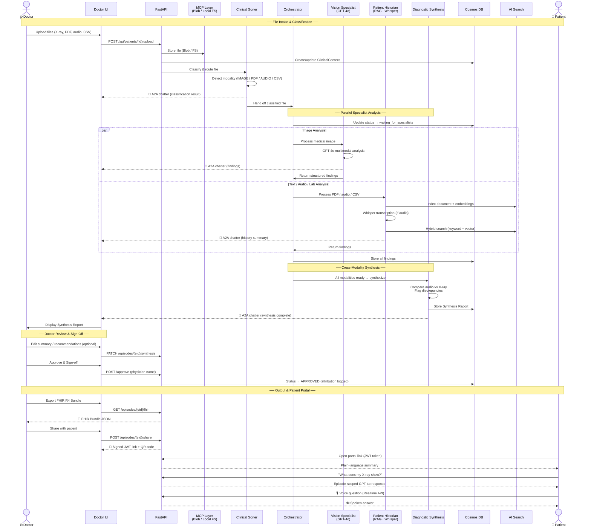

# MedNexus — Multi-Agent Healthcare Orchestration Platform




**MedNexus** is a multi-agent clinical intelligence system that processes multimodal medical data — X-rays, PDFs, lab CSVs, and patient audio recordings — through a pipeline of specialized AI agents, culminating in a cross-modality Diagnostic Synthesis Report.

Built on the **Microsoft Agent Framework** with **A2A (Agent-to-Agent)** communication, **MCP (Model Context Protocol)** for data abstraction, and **Azure AI Foundry** for intelligence.

> **Hackathon Categories:** Grand Prize — Build AI Applications & Agents | Best Multi-Agent System | Best Azure Integration | Best Enterprise Solution

---

## Hero Technologies Used

| Hackathon Requirement | How MedNexus Uses It |
|---|---|
| **Microsoft Agent Framework** | 5 specialized agents (Orchestrator, Clinical Sorter, Vision Specialist, Patient Historian, Diagnostic Synthesis) with a state-machine controller and async A2A event bus |
| **Azure MCP** | MCP abstraction layer with hot-swap factory (Local FS ↔ Azure Blob), plus a full MCP SDK Clinical Data Gateway server exposing `get_patient_records` and `fetch_medical_image` tools with HIPAA audit logging |
| **Microsoft Foundry / Azure OpenAI** | GPT-4o for multimodal vision analysis (X-rays), cross-modality synthesis, patient-facing chat, and real-time voice assistant via Azure OpenAI Realtime API |
| **GitHub Copilot Agent Mode** | Entire project built with GitHub Copilot Agent Mode in VS Code — architecture design, agent implementations, React UI, Docker configs, and iterative debugging |
| **Azure Deployment** | Deployed to Azure Container Apps (frontend + backend), backed by Cosmos DB, AI Search, Blob Storage, and Azure Speech Services |

---

## What is MedNexus?

A doctor receives an X-ray, a lab report, a voice recording from the patient, and a 40-page PDF history — all for the same visit. Today, they piece those together manually. MedNexus does it for them.

**MedNexus is an AI-powered clinical copilot that reads every file a doctor drops in — images, documents, audio, labs — and produces a single, unified Diagnostic Synthesis Report in seconds.**

### What it does

- **Drop files, get answers.** Upload an X-ray, a PDF referral, a patient voice note, and lab results. Five specialized AI agents analyze each one in parallel and merge the findings into one coherent report.
- **Catch what humans miss.** The system cross-references modalities automatically — if a patient says *"no chest pain"* but the X-ray shows a pulmonary infiltrate, MedNexus flags the discrepancy.
- **Doctor stays in control.** Nothing leaves the system without an MD sign-off. The doctor reviews the synthesis, approves it, and only then can it be shared.
- **Patients get clarity, not confusion.** Once approved, the doctor shares a secure link (or QR code). The patient opens a mobile-friendly portal that explains findings in plain, everyday language — no medical jargon.
- **Patients can ask questions.** The portal includes a text chat and a real-time voice assistant. Patients can ask *"What does this mean for me?"* and get answers scoped only to their own clinical data.
- **Full episode-based workflow.** Each visit is an episode. A patient can have many episodes over time, and each one tracks its own files, findings, synthesis, approval, and actions — giving doctors a longitudinal view.
- **EHR-ready FHIR R4 export.** Signed-off episodes can be exported as standards-compliant FHIR R4 transaction Bundles (Patient + DiagnosticReport + Observations), ready to feed into downstream EHR systems.
- **Visual agent pipeline stepper.** Each episode card shows a horizontal 4-step pipeline (Intake → Specialist → Cross-Check → Synthesis) with animated progress — green checkmarks for completed steps, a pulsing indicator for the active step, and specialist details pulled from the activity log.
- **Doctor Chat Assistant.** A floating chat panel powered by GPT-4o with function-calling tools. Doctors can ask natural-language questions like *"Show me the last patient"* or *"What did the X-ray find?"* — the assistant queries patients, loads contexts, and retrieves findings or synthesis reports on demand.
- **Platform Observability dashboard.** A built-in admin page (accessible from the sidebar) showing real-time platform stats, per-agent activity breakdowns, MCP operation counts, success/failure rates, and a filterable HIPAA audit trail table — giving operators full visibility into agent behaviour without leaving the UI.
- **Live agent transparency.** A real-time "Agent Chatter" pane shows every agent's reasoning as it works — what it found, what it decided, what it handed off — so doctors understand *how* the AI reached its conclusions.
- **"My Story" — Empathy Addon.** Inspired by Johns Hopkins' *This Is My Story* (TIMS) research — studies show a 74 % increase in empathy and 99 % improvement in meaningful interactions when care teams know the patient as a person. A compact card on every patient view captures four questions: *How do you prefer to be addressed?*, *What brings you joy?*, *What does your care team need to know?*, and *What brings you peace?* Answers are persisted to Cosmos DB **and** indexed into AI Search, so the Patient Historian RAG agent automatically discovers personal context alongside clinical findings — enabling synthesis reports that reference the whole patient, not just the diagnosis.

### Who it's for

| Role | What they get |
|---|---|
| **Doctor** | A command center that turns raw multimodal files into a reviewed, approved diagnostic report — faster and with fewer blind spots |
| **Patient** | A personal portal with plain-language results, a chat to ask questions, and a voice assistant — accessible from any phone via a shared link |
| **Hospital** | Audit-logged, HIPAA-aware data access with doctor attribution on every clinical decision |

### The workflow in 30 seconds

```
 1. Doctor opens MedNexus → Patient Grid shows all patients at a glance
 2. Selects a patient → Uploads files (X-ray, PDF, audio, labs)
 3. AI agents process in parallel → Findings appear in real time
 4. Cross-modality Synthesis Report is generated automatically
 5. Doctor reviews → edits summary/recommendations if needed → signs off
 6. Downloads FHIR R4 Bundle for EHR integration (optional)
 7. Clicks "Share" → QR code / link generated with a secure token
 8. Patient opens the portal on their phone
 9. Reads plain-language summary → Chats or voice-asks follow-up questions
```

---

## Architecture



### Agent Pipelines

1. **Clinical Sorter** — Monitors the MCP drop-folder, classifies incoming files (PDF, DICOM, IMAGE, AUDIO, LAB_CSV) and extracts patient IDs from filenames. **Phase 3:** Primary consumer of the MCP Clinical Data Gateway — uses `get_patient_records` and `fetch_medical_image` tools.
2. **Vision Specialist** — Processes medical images via GPT-4o multimodal. Returns structured findings with region, observations, impression, and confidence scores. **Phase 3:** Routes image access through the Clinical Data Gateway for audit logging.
3. **Patient Historian** — Performs RAG via Azure AI Search. Extracts text from PDFs, transcribes audio (Whisper), and synthesizes patient history.
4. **Orchestrator** — State-machine controller. Routes files to appropriate specialists, tracks status transitions in Cosmos DB, and triggers synthesis when all modalities arrive.
5. **Diagnostic Synthesis** — Cross-modality analysis. Compares audio transcript statements against X-ray findings, identifies discrepancies, and produces a severity-rated Synthesis Report.

### End-to-End Flow



---

## Project Structure

```
mednexus-hackathon/
├── src/mednexus/
│   ├── agents/             # All agent implementations
│   │   ├── base.py         # BaseAgent ABC with A2A messaging
│   │   ├── orchestrator.py # State-machine handoff controller
│   │   ├── clinical_sorter.py
│   │   ├── vision_specialist.py
│   │   ├── patient_historian.py
│   │   └── diagnostic_synthesis.py
│   ├── a2a/                # Agent-to-Agent event bus
│   │   └── __init__.py     # In-process bus with WS broadcast
│   ├── api/
│   │   └── main.py         # FastAPI app (REST + WebSocket)
│   ├── mcp/                # Model Context Protocol abstraction
│   │   ├── base.py         # Abstract MCPServer interface
│   │   ├── local_fs.py     # Local filesystem MCP
│   │   ├── azure_blob.py   # Azure Blob Storage MCP
│   │   ├── factory.py      # Hot-swap factory
│   │   ├── clinical_gateway.py  # Phase 3: MCP SDK Clinical Data Gateway
│   │   └── audit.py        # Phase 3: HIPAA-compliant audit logger
│   ├── models/             # Pydantic v2 schemas
│   │   ├── clinical_context.py  # Core state document
│   │   ├── agent_messages.py    # A2A message envelope
│   │   └── medical_files.py     # File classification
│   ├── services/           # Azure SDK clients
│   │   ├── cosmos_client.py     # Cosmos DB state manager
│   │   ├── llm_client.py        # Azure OpenAI (multimodal)
│   │   ├── search_client.py     # AI Search RAG queries
│   │   ├── speech_client.py     # Whisper transcription
│   │   └── fhir_export.py       # FHIR R4 Bundle export
│   ├
│   └── config.py           # pydantic-settings configuration
├── ui/                     # React + Vite + Tailwind frontend
│   ├── src/
│   │   ├── App.tsx
│   │   ├── components/
│   │   │   ├── Sidebar.tsx
│   │   │   ├── ClinicalWorkspace.tsx
│   │   │   ├── AgentChatter.tsx
│   │   │   ├── FileUploader.tsx
│   │   │   ├── StatusBadge.tsx
│   │   │   ├── AgentStepper.tsx  # Visual pipeline progress per episode
│   │   │   ├── ChatPanel.tsx     # Doctor Chat Assistant (GPT-4o)
│   │   │   ├── ObservabilityPage.tsx # Admin observability dashboard
│   │   │   ├── MyStoryCard.tsx   # "My Story" empathy addon (4-question card)
│   │   │   └── cards/      # Multimodal display cards
│   │   ├── hooks/          # useWebSocket, usePatientContext
│   │   └── types.ts        # Shared TypeScript interfaces
│   ├── vite.config.ts
│   └── tailwind.config.js
├── data/
│   ├── intake/             # Local MCP drop-folder
│   └── samples/            # Judge test data (sample-01, sample-02)
├── docker-compose.yml
├── Dockerfile
|── Dockerfile.backend
|── Dockefile.frontend
├── Dockerfile.ui
├── pyproject.toml
├── requirements.txt
└── .envvarsexample
```

---

## Prerequisites

- **Python 3.11+**
- **Node.js 20+** (for the UI)
- An **Azure subscription** with the following services provisioned:
  - Azure OpenAI (GPT-4o deployment, Whisper transcription)
  - Microsoft Foundry (GPT Realtime Model, for Patient Assistant)
  - Azure Cosmos DB (NoSQL API)
  - Azure AI Search
  - Azure Blob Storage
  - User Assigned Managed Identity
  - Azure Container Apps Environment

---

## Quick Start

### 1. Clone & Configure

```bash
git clone <repo-url>
cd mednexus-hackathon
cp .env.example .env
# Fill in your Azure credentials in .env
```

### 2. Backend

```bash
# Create virtual environment
python -m venv .venv
# Windows
.venv\Scripts\activate
# macOS/Linux
source .venv/bin/activate

# Install dependencies
pip install -e ".[dev]"

# Start the API server
uvicorn mednexus.api.main:app --reload --port 8000
```

### 3. Frontend

```bash
cd ui
npm install
npm run dev
# Open http://localhost:5173
```

### 4. Docker (alternative)

```bash
# Full stack (API + UI + Cosmos Emulator)
docker compose up --build

# Or production single image
docker build --target production -t mednexus .
docker run -p 8000:8000 --env-file .env mednexus
```

---

## Environment Variables

| Variable | Description |
|---|---|
| `AZURE_OPENAI_ENDPOINT` | Azure OpenAI resource endpoint |
| `AZURE_OPENAI_API_KEY` | Azure OpenAI API key |
| `AZURE_OPENAI_DEPLOYMENT` | Azure OpenAI text model deployment name |
| `AZURE_OPENAI_API_VERSION` | Azure OpenAI API version |
| `AZURE_OPENAI_EMBEDDING_DEPLOYMENT` | Embedding model deployment name |
| `AZURE_OPENAI_EMBEDDING_DIMENSIONS` | Embedding vector dimensions |
| `AZURE_OPENAI_WHISPER_DEPLOYMENT` | Whisper speech-to-text deployment name |
| `AZURE_AI_VISION_ENDPOINT` | Azure AI Vision endpoint |
| `AZURE_AI_VISION_KEY` | Azure AI Vision key |
| `AZURE_SEARCH_ENDPOINT` | Azure AI Search endpoint |
| `AZURE_SEARCH_KEY` | Azure AI Search key |
| `AZURE_SEARCH_INDEX` | Azure AI Search index name |
| `COSMOS_ENDPOINT` | Cosmos DB endpoint |
| `COSMOS_KEY` | Cosmos DB key |
| `COSMOS_DATABASE` | Cosmos DB database name |
| `COSMOS_CONTAINER` | Cosmos DB container name |
| `AZURE_STORAGE_CONNECTION_STRING` | Blob Storage connection string |
| `AZURE_STORAGE_CONTAINER` | Blob Storage container name |
| `AZURE_OPENAI_REALTIME_ENDPOINT` | Azure OpenAI Realtime endpoint |
| `AZURE_OPENAI_REALTIME_KEY` | Azure OpenAI Realtime key |
| `AZURE_OPENAI_REALTIME_DEPLOYMENT` | Azure OpenAI Realtime deployment name |
| `MEDNEXUS_LOG_LEVEL` | Application log level |
| `MEDNEXUS_CORS_ORIGINS` | Allowed CORS origins (comma-separated) |
| `MCP_DROP_FOLDER` | Local drop-folder path |
| `PORTAL_JWT_SECRET` | JWT secret used to sign portal tokens |
| `PORTAL_JWT_EXPIRY_HOURS` | Portal token expiry in hours |

Additional Managed Identity variables:

| Variable | Description |
|---|---|
| `USE_MANAGED_IDENTITY` | Managed Identity toggle (`true` / `false`) |
| `MANAGED_IDENTITY_CLIENT_ID` | User-assigned Managed Identity client ID |
| `AZURE_STORAGE_ACCOUNT_URL` | Storage account URL used with Managed Identity |

Managed Identity roles:

- `AcrPull`
- `Storage Blob Data Contributor`
- `Azure AI Developer`
- `Cognitive Services OpenAI Contributor`
- `Search Index Data Contributor`
- `Key Vault Secrets User`


When `AZURE_STORAGE_CONNECTION_STRING` is set, the MCP layer uses Azure Blob Storage; otherwise it falls back to the local filesystem.

---

## API Endpoints

| Method | Path | Description |
|---|---|---|
| `GET` | `/health` | System health & registered agents |
| `GET` | `/api/patients` | List all patient contexts |
| `GET` | `/api/patients/{id}` | Retrieve a patient's Clinical Context |
| `POST` | `/api/patients/{id}` | Create a new patient context |
| `DELETE` | `/api/patients/{id}` | Cascade-delete patient (Cosmos + Blob + AI Search) |
| `POST` | `/api/patients/{id}/upload` | Upload a medical file → triggers agent pipeline |
| `POST` | `/api/patients/{id}/episodes` | Create a new episode for a patient |
| `GET` | `/api/patients/{id}/episodes` | List all episodes for a patient |
| `PATCH` | `/api/patients/{id}/episodes/{eid}/activate` | Set a specific episode as the active episode |
| `DELETE` | `/api/patients/{id}/episodes/{eid}` | Delete an episode and its associated data |
| `PATCH` | `/api/patients/{id}/episodes/{eid}/synthesis` | Edit Synthesis Report before MD sign-off |
| `POST` | `/api/patients/{id}/approve` | MD sign-off on Synthesis Report (Human-in-the-Loop) |
| `GET` | `/api/patients/{id}/episodes/{eid}/fhir` | **FHIR R4 Export** — download signed-off episode as a FHIR Bundle |
| `POST` | `/api/patients/{id}/episodes/{eid}/share` | Generate a signed patient portal token for an approved episode |
| `POST` | `/api/chat` | Doctor Chat with GPT-4o function-calling |
| `WS` | `/ws/chatter` | Live Agent-to-Agent message stream |
| `GET` | `/api/images/{filename}` | Proxy medical image bytes for UI rendering |
| `GET` | `/api/chatter/history` | Recent A2A messages for late-joining clients |
| `GET` | `/api/patients/{id}/mystory` | Retrieve a patient's My Story empathy narrative |
| `POST` | `/api/patients/{id}/mystory` | Save/update My Story and index for RAG |
| `GET` | `/api/audit` | HIPAA audit trail (MCP gateway access log) |
| `GET` | `/api/stats` | Platform statistics (patients, agents, operations) |
| `GET` | `/api/portal/context?token=...` | Patient portal context (JWT-secured) |
| `POST` | `/api/portal/chat?token=...` | Patient portal text chat (episode-scoped) |
| `WS` | `/ws/portal/voice?token=...` | Patient portal realtime voice assistant proxy |

---

## Key Design Decisions

### MCP Abstraction
The MCP layer wraps data sources behind a uniform `list_files()` / `read_bytes()` / `watch()` interface. A factory function inspects configuration to return either `LocalFileSystemMCP` or `AzureBlobMCP` — agent code never changes.

### A2A In-Process Bus
Rather than HTTP-based inter-agent RPC, MedNexus uses an in-process async event bus with an observer pattern. Each A2A message is:
- Routed to the target agent's inbox
- Logged to a rolling history buffer
- Broadcast to all WebSocket observers (the UI's Agent Chatter pane)

### Status Semaphore
The `ClinicalContext.status` field acts as a state-machine semaphore (`intake → waiting_for_radiology → waiting_for_history → synthesizing → finalized`), preventing agents from processing out of order.

### Multimodal Vision
The Vision Specialist sends medical images as base64 payloads to GPT-4o's multimodal endpoint, receiving structured JSON findings with confidence scores.

### Cross-Modality Synthesis
The Diagnostic Synthesis Agent specifically compares **audio transcript statements** against **X-ray findings** to detect discrepancies — e.g., a patient says "no chest pain" but imaging shows a pulmonary infiltrate.

### Phase 3: Clinical Data Gateway (MCP SDK)
A proper MCP-protocol server (`clinical_gateway.py`) built with the Python `mcp` SDK. It exposes:
- **`get_patient_records`** tool — lists all files for a patient, grouped by modality, with patient-scoped access control.
- **`fetch_medical_image`** tool — returns base64-encoded image data with strict cross-patient access prevention.
- **`clinical_protocol`** resource — read-only hospital standard analysis protocol.

All tool invocations are **audit-logged** to `data/audit/mcp_audit.jsonl` (HIPAA-compliant structured entries) via the `MCPAuditLogger` class.

### Synthesis Report Editing (Pre-Sign-Off)
Before approving, doctors can **edit the Synthesis Report** directly in the UI — clicking the pencil icon switches the summary, cross-modality notes, and recommendations into editable textareas. Edits are persisted via `PATCH /api/patients/{id}/episodes/{eid}/synthesis` and logged as a `synthesis_edited` audit entry with the specific fields changed. Once an episode is signed off, further edits are blocked (HTTP 409). This ensures the final approved report reflects the physician's clinical judgment.

### Human-in-the-Loop MD Sign-Off
The Synthesis Report card in the AGUI includes a prominent **"Approve and Sign-off by MD"** button. When clicked, it prompts for the physician's name and calls `POST /api/patients/{id}/approve`. The context transitions to `APPROVED` status with full attribution (who, when, notes). This ensures no diagnostic output leaves the system without a qualified human review.

### Platform Observability Dashboard
A dedicated admin page accessible from the sidebar gives operators real-time visibility into the entire platform without leaving the UI. It is powered by two backend endpoints:

- **`GET /api/stats`** — returns aggregate counters: total patients, total findings, per-agent activity breakdown (how many findings each agent produced), agent status, MCP operation counts, and success/failure rates.
- **`GET /api/audit`** — returns the most recent HIPAA-compliant audit trail entries from the MCP Clinical Data Gateway (`MCPAuditLogger`), each with timestamp, agent ID, patient ID, action, and outcome.

The frontend (`ObservabilityPage.tsx`) renders this data as:
| Section | What it shows |
|---|---|
| **Stat cards** | Patients, findings, agents, MCP operations at a glance |
| **Agent activity chart** | Horizontal bar breakdown by agent (how many findings each produced) |
| **MCP operations chart** | Success vs. failure counts across gateway tool calls |
| **Audit trail table** | Filterable, scrollable log of every MCP access event with timestamps and status badges |

The page uses the same view-state pattern as the rest of the app (`View = 'grid' | 'patient' | 'observability'`) — no router needed. A sidebar button toggles the view, and a "Back to Patient Grid" button returns to the main workflow. All data refreshes on each visit; no polling or WebSocket connection is required.

### "My Story" — Patient Empathy Narrative
Inspired by Johns Hopkins' *This Is My Story* (TIMS) research (Bains et al., JMIR Medical Informatics 2026), which demonstrated a **74 % increase in clinician empathy** and **69 % reduction in patient distress** when care teams engage with patients' personal narratives. MedNexus implements the four core TIMS questions in a compact, 2-column card on the patient view:

1. **How do you prefer to be addressed?**
2. **What brings you joy?**
3. **What does your care team need to know about you?**
4. **What brings you peace or comfort?**

Answers are saved to Cosmos DB (`{patient_id}__mystory` document) and simultaneously indexed into Azure AI Search with `content_type: "my_story"`. Because the Patient Historian agent performs RAG via AI Search filtered by `patient_id`, personal narrative context **automatically surfaces** alongside clinical findings — without any modifications to existing agent code. This means synthesis reports can reference the patient as a whole person, not just a set of diagnostic data points.

The card supports three recording sources (Staff, Family, Patient) and tracks `recorded_by` + `recorded_at` metadata for audit purposes.

### FHIR R4 Export
Once an episode is signed off, doctors can **export it as a FHIR R4 transaction Bundle** (`GET /api/patients/{id}/episodes/{eid}/fhir`). The bundle contains:
- **Patient** resource with demographics
- **DiagnosticReport** resource from the Synthesis Report (summary, recommendations, timestamps)
- **Observation** resources for each clinical finding, LOINC-coded by modality (radiology → `18748-4`, clinical text → `34133-9`, audio transcript → `75032-5`, lab → `26436-6`)

The export is only available for approved episodes (returns HTTP 403 otherwise), ensuring only physician-reviewed data enters downstream EHR systems. Built with the `fhir.resources` library for standards-compliant serialization.

---
## Responsible AI & Security

MedNexus is designed with healthcare-grade safety and compliance in mind:

| Principle | Implementation |
|---|---|
| **Human-in-the-Loop** | No diagnostic output leaves the system without an MD sign-off. The doctor reviews, optionally edits, and explicitly approves every Synthesis Report before it can be shared with the patient. |
| **Patient-Scoped Data Isolation** | The MCP Clinical Data Gateway enforces per-patient access boundaries. An agent processing Patient A cannot access Patient B's files — cross-patient access is blocked at the tool level, not just the UI. |
| **HIPAA-Compliant Audit Logging** | Every MCP tool invocation (file access, image fetch) is logged to `data/audit/mcp_audit.jsonl` with timestamp, agent ID, patient ID, tool name, and parameters. Every approval records the physician name, timestamp, and notes. |
| **Secure Portal Access** | Patient portals are accessed via JWT tokens with configurable expiry. Tokens are scoped to a single patient and signed with a server-side secret. No login credentials are exposed to patients — just a link or QR code. |
| **Transparent AI Reasoning** | The Agent Chatter pane shows every agent's decision chain in real time. Doctors can see what each agent found, what it decided, and why — building trust and enabling oversight. |
| **No PII in Agent Logs** | A2A messages broadcast to the UI contain agent reasoning summaries, not raw patient data. Structured clinical findings are stored only in the patient's Cosmos DB context document. |

---

## Try It — Judge Testing Guide

Two ready-made sample folders are included in [`data/samples/`](data/samples/) — see the [Sample Data README](data/samples/README.md) for detailed descriptions of each case.

| Folder | Scenario | Files |
|---|---|---|
| `sample-01/` | Chest / Respiratory case | X-ray, bloodwork CSV, patient transcript, referral letter |
| `sample-02/` | Sports Injury / Musculoskeletal | 2 images, audio recording (MP3), transcript |

### Quick Test (Live Deployment)

1. Open the deployed frontend (URL provided in submission)
2. Click any patient on the **Patient Grid** — or create a new one by typing a name or patient ID (e.g. `P037`) and pressing Enter
3. Click **Upload File** and navigate to `data/samples/sample-01/` (or `sample-02/`)
4. **Tip:** The file picker defaults to *"Custom Files"* which hides `.txt` and `.csv` files. Change the dropdown to **"All Files"** to see everything.
5. Upload files one at a time — watch the **Agent Stepper** on each episode card animate through the pipeline (Intake → Specialist → Cross-Check → Synthesis)
6. Watch the **Agent Chatter** pane — you'll see each agent classify, analyze, and hand off in real time
7. Once all agents finish, the **Synthesis Report** card appears with cross-modality findings
8. (Optional) Click the **✏️ Edit** button on the Synthesis Report to adjust the summary or recommendations before sign-off
9. Click **"Approve and Sign-off by MD"** → enter any name → report is finalized
10. After approval, click **"FHIR R4 Export"** → downloads a standards-compliant FHIR Bundle JSON
11. Click **"Share"** → copy the link or scan the QR code
12. Open the link on your phone → see the **Patient Portal** with plain-language summary
13. Try the **text chat** ("What does my X-ray show?") and the **voice assistant** (tap the mic)
14. Back in the doctor view, try the **Doctor Chat** (bottom-right bubble) — ask *"Show me the last patient"* or *"What findings do we have?"*

### Local Setup

See [Quick Start](#quick-start) below. After `docker compose up --build`, open `http://localhost:5173` and follow the same steps above.

---
## Development

```bash
# Run tests
pytest

# Lint & format
ruff check src/ --fix
ruff format src/

# Type checking
mypy src/
```

---

## Tech Stack

| Layer | Technology |
|---|---|
| **Orchestration** | Microsoft Agent Framework, A2A Protocol |
| **Data Abstraction** | MCP (Model Context Protocol) |
| **Intelligence** | Azure OpenAI GPT-4o (text + vision) |
| **State** | Azure Cosmos DB (NoSQL API) |
| **Search / RAG** | Azure AI Search |
| **Storage** | Azure Blob Storage |
| **Speech** | Azure OpenAI Whisper | Microsoft Foundry OpenAI gpt-realtime-1.5
| **Interoperability** | FHIR R4 (fhir.resources) |
| **Backend** | FastAPI + Uvicorn |
| **Frontend** | React 19 + Vite 6 + TypeScript + Tailwind CSS |
| **Infrastructure** | Docker, Azure Container Apps |
| **Dev Tools** | VS Code, GitHub Copilot Agent Mode, GitHub |

---

## Built With GitHub Copilot

This project was built using **GitHub Copilot Agent Mode** in VS Code — The initial architecture design was communicated with TEXT files and prompts leading to agent implementations with the React UI, Docker configurations, and iterative debugging. Copilot Agent Mode was used not just for code generation but as an active development partner: researching APIs, diagnosing race conditions, auditing CSS for UI bugs, and reasoning through multi-agent orchestration patterns.

---

## License

This project was built for the **AI Dev Days Hackathon 2026**. See LICENSE for details.
Owner: passadis@outlook.com
